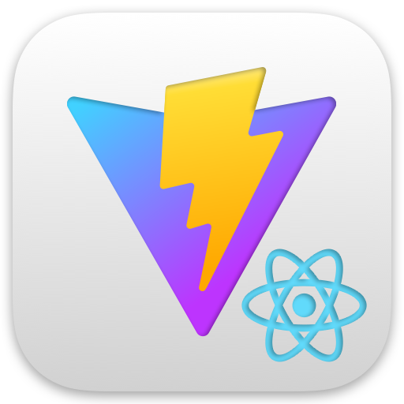

# WebTM  

Web Time Machine is a cross-platform solution built using React, Vite, and TypeScript to integrate the navigation history between desktop and mobile web browsers. Focusing on providing a solution for an integration between Google Chrome, Safari, Firefox, Android and iOS. This repository implements the backend solution with a NestJS application that provides a REST API and a PostgreSQL database used through PrismaORM.

## Installation

```bash
npm run app:install
npm run backend:install
```

<br/>

## Running with Docker

If you are pointing to your local database, you can use Docker Compose inside the backend folder to run the application. Before running the command, ensure that you have Docker and Docker compose installed on your system. You can download and install Docker Desktop from [here](https://www.docker.com/products/docker-desktop/).
Execute the following command in your terminal:

```bash
cd backend
docker compose up
```

Also you can run the ngrok to get a public access to your API. That's so useful when you are debugging on from any device regardless your local network. For that, do:

1. Visit the [Ngrok website](https://ngrok.com/) and sign up for an account.
2. After signing up, navigate to the dashboard to obtain your authentication token and domain

<br/>

## Set the Backend Environment Variables

To see the full configuration file with all the variables and explanation, look at this guide: [Backend Environment Variables](/guides/setup-backend-environment-variables.md)

<br/>

## Running the backend

```bash
# development
npm run backend:dev

# production mode
npm run backend:prod
```

## Open API Docs

To see the Open API Specification navigate to / of your API running on the port you have enter in the .env. Ex: [http://localhost:5000/](http://localhost:5000/)

<br/>

## Installation Walkthrough

To see the full installation walkthrough with and step by step video look at this guide [Installation Guide](/guides/installation-walkthrough.md)

<br/>

## Deploy WTM backend on Vercel

Deploy [this repository](https://github.com/webtimemachine/wtm2) into your vercel account using the following button. After the deploy is complete you will need to go to the project settings and change the root folder to `backend` and also set the env variables.

[](https://vercel.com/new/clone?repository-url=https%3A%2F%2Fgithub.com%2Fwebtimemachine%2Fwtm2)

<br/>

## Create a Vercel Postgres Serverless SQL

The backend of WTM uses a PostgressDB, we recommend using Vercel Postgres. In order to do that you need to go to your Vercel dashboard on the tab 'Storage' and create a new DB. Then you need to setup the connection with your app, open the Advanced Options an set `DATABASE` as the envaronment variables prefix. After doing that, you can do to the env variables of you project and get the DATABASE_URL and DATABASE_URL_NON_POOLING to use on your local, connect to the database using an SQL client like [DBeaver](https://dbeaver.io/) and update your repository secrets.


<br/>

## Build the Extension

```bash
npm run app:install
npm run app:build
```

As a result you will found the built folders for chrome and firefox at the root folder on `app_chrome` and `app_firefox`

<br/>

## Install the extension in Chrome (using the .zip file or the extension folder)

- Click on the **Settings** icon located in the top-right corner of your Chrome browser. It resembles three vertically aligned dots, also known as the 'hamburger' icon.

- From the dropdown menu, hover over the **Tools** option, then select **Extensions**.

- Navigate to the location of the .zip file you wish to install. Unzip it where you want to let it installed (Desktop, for example). Keep in mind that if you want to use your local code, don't do anything.

- Click on the **Load unpacked** button located in the top-left corner of the screen. This action opens a file selection dialog.

- Select the folder where you had unziped or select the folder where your extension code is in local and click on the **Open** button. Chrome will begin installing the extension.

- Once completed, you'll see a notification confirming the successful installation. The extension should now be visible in your list of installed extensions.

Created by ttt246
