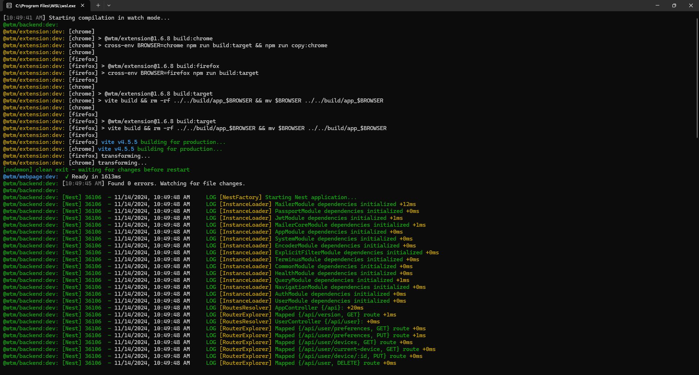
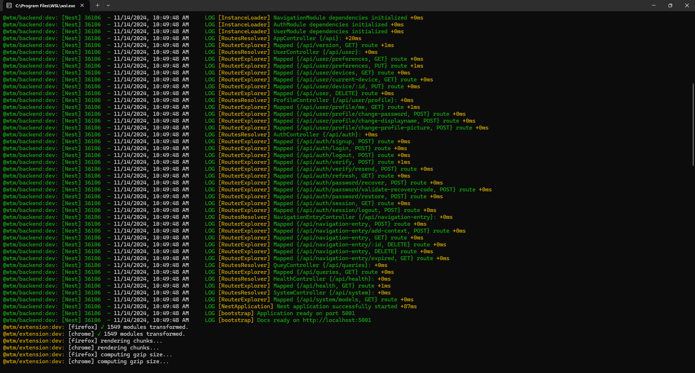
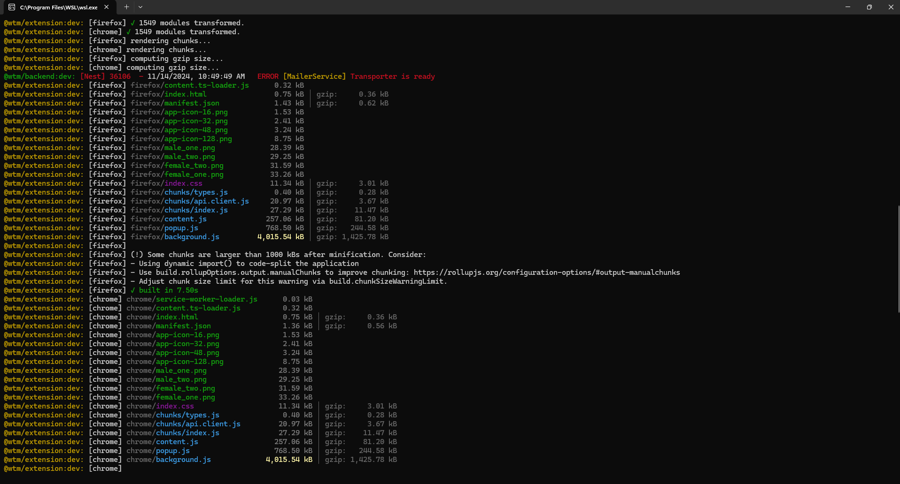
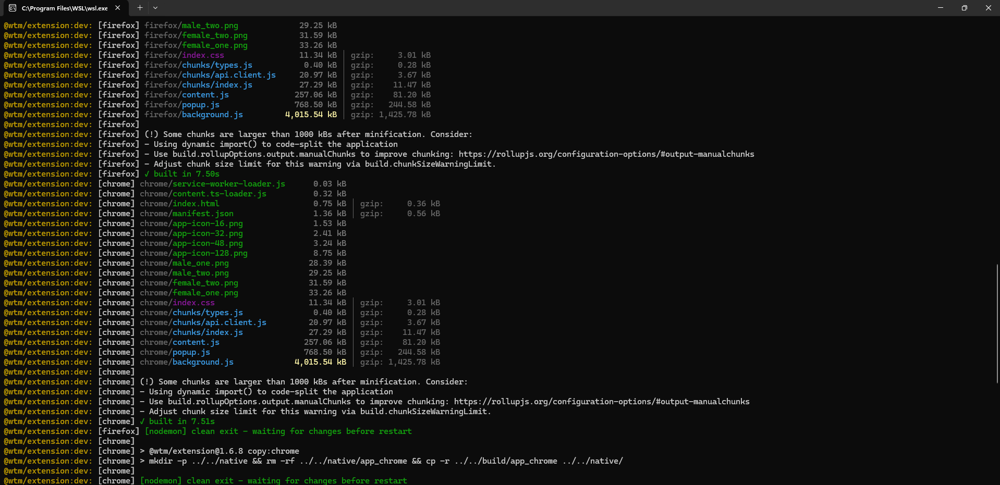

# Project Initialization Steps for Windows

## 1. Install WSL (Windows Subsystem for Linux)

To run this repository, you'll need to install WSL. Follow this [guide](https://learn.microsoft.com/en-us/windows/wsl/install) to set up WSL on your system.

## 2. Install Required Packages

Ensure you have the following installed:

- **Node.js**
- **NVM** (Node Version Manager) – to switch between Node versions
- **Git**
- **Docker**
- **VS Code** (Visual Studio Code)

## 3. Add an SSH Key to WSL and GitHub

Generate an SSH key in WSL and add it to your GitHub account to enable cloning the repository via SSH.

## 4. Install VS Code Remote Development

Set up remote development with VS Code using WSL. Here’s a helpful [tutorial](https://code.visualstudio.com/docs/remote/wsl-tutorial) for configuration.

## 5. Clone the Repository

Clone the repository via SSH:

```
git clone git@github.com:webtimemachine/wtm2.git
```

## 6. Setting Up the Project

1. **Compose Up**: Run `docker-compose.yml` to set up Docker containers.
2. **Environment Files**: Create `.env` and `db.env` files, ensuring they include the necessary environment variables.

## 7. Install Dependencies

In the root directory of the project (not in `apps/backend` or `apps/webpage`), run:

```
npm install
```

## 8. Start the Development Server

Once dependencies are installed, start the development server with:

```
npm run dev
```

_Note: `npm run dev` on root it will bring up Webpage, Backend and Build the extension. All three together, thanks to TurboRepo. If having any issues related to, please contact support._

## 9. Terminal Result

Some images of how Terminal should look like after `npm run dev`






## Enjoy Web Time Machine!
