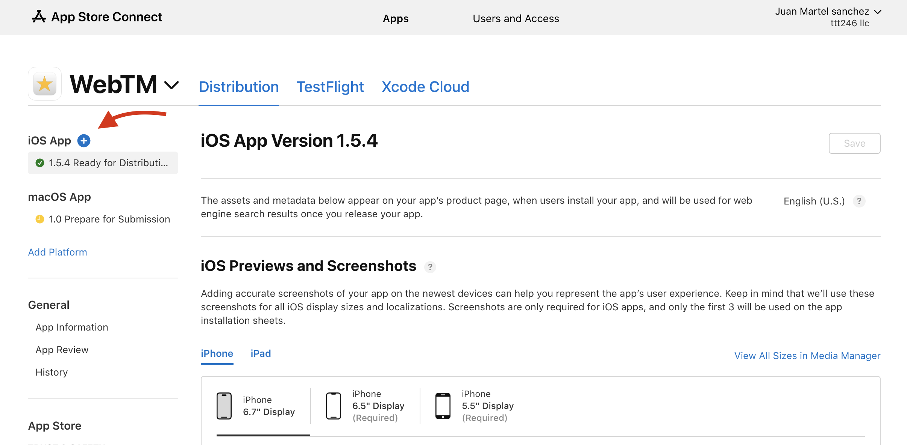

# How to submit a new release from Testflight to Apple Store

- Access and Login into [Apple Store Connect](https://appstoreconnect.apple.com/login)
- Check you are login as a correct development team meamber. On the top right corner you can see your name and the development team name.
- Click on the `App` button
- On the left side, click on `+` button next to `iOS App` title.

- A modal with an input field will appeare
- Fill the correct app version and press `Create`
- Fill the textarea `News in this version` and select the correct compilation.
- Press `Save` and then `Submit for review` on the top right corner.
