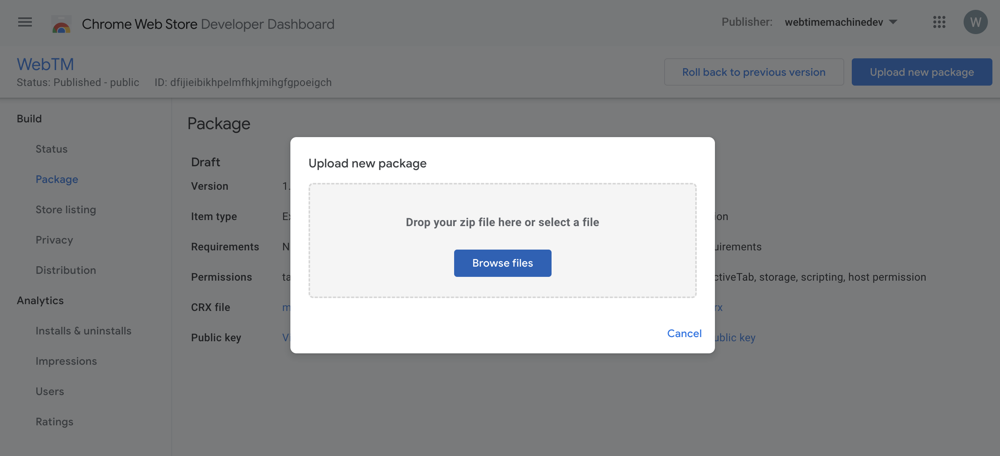

# How to submit a new release to Chrome Web Store

- Download the `chrome-extension.zip` file from the last [Github Releases](https://github.com/webtimemachine/wtm2/releases).
- Access and Login into [Chrome Web Store](https://chrome.google.com/webstore/devconsole/)
- Click on WebTM item to access to the Dashboard
- On the left panel, click on the Package option.
- Click on the bottom `Upload a new package` on the top right corner and select the downloaded zip file.

- Click on the bottom `Submit for review` on the top right corner and then confirm the modal clicking on `Submit for review` botton again.
