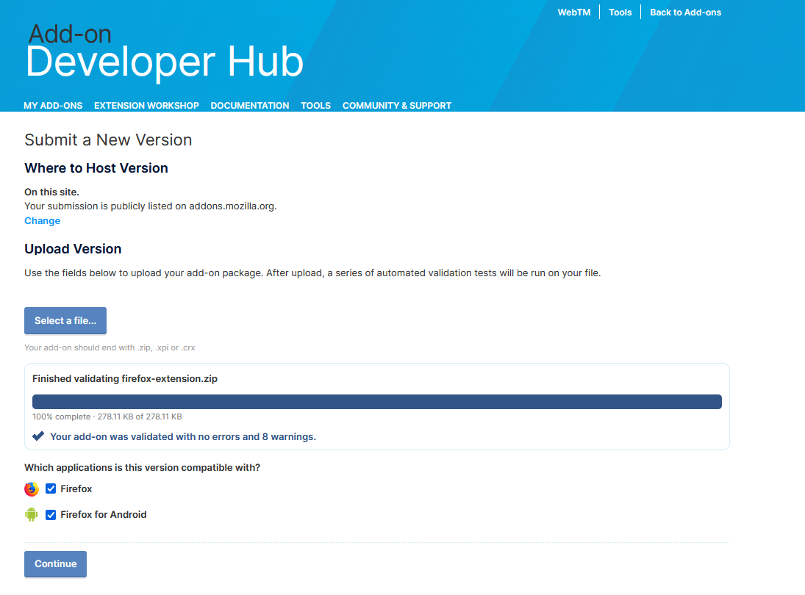

# How to submit a new release to Firefox Addon Store

- Download the `firefox-extension.zip` file from the last [Github Releases](https://github.com/webtimemachine/wtm2/releases).
- Access and Login into [Firefox Addon Developer Hub](https://addons.mozilla.org/en-US/developers/addons)
- Click on WebTM item to access to the Dashboard
- On the left panel, click on the Package option.
- Click on the bottom `Upload a new version` and select the downloaded zip file.
- After the upload finished, enable the Firefox for Android option to publish the addon for mobile as well.

- Click on the bottom `Continue` to finish the submission of the new version.
