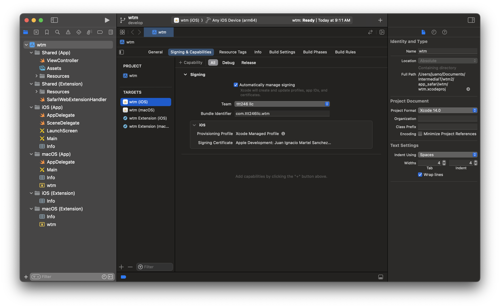
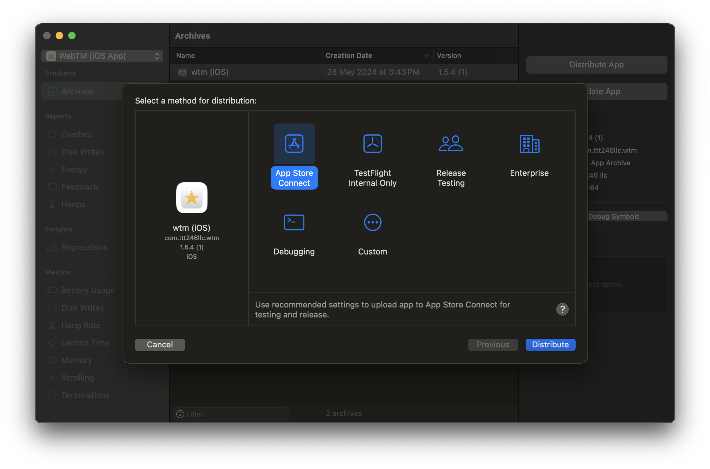

# How to deploy on Testflight

- Use NVM to use the correct Node version, with the following command:

```
  nvm use
```

- Build Chrome extension: As a first step, we have to build the extension code to create the `app_chrome` folder using this command from the root folder.

```
  npm run app:build:chrome
```

- Onces the the Chrome extension build is Done, we need to create the build for Safari using

```
npm run app:build:ios
```

This command will generate a new folder named `app_safari`

- Inside `app_safari` we can find the Xcode project file `app_safari/wtm/wtm.xcodeproj`. Open it using Xcode.
- Open project settings, and go to `Signing & Capabilities` tab.
- On the left side, you can see the Target list. Select both iOS targets and set them the correct development team (example: `ttt246 llc`)



- Then go to `General` tab update the version or the build number as appropriate.
- On Xcode action bar go to `Product` and click on `Archive` option.
- When the process finished, a new window will be opened and you can choose the correct build, and click on `Distribute App`. Select `App Store Connect` option and click on `Distribute` button.



- Your build will be submited and in a few minutes will be able on Testflight.
